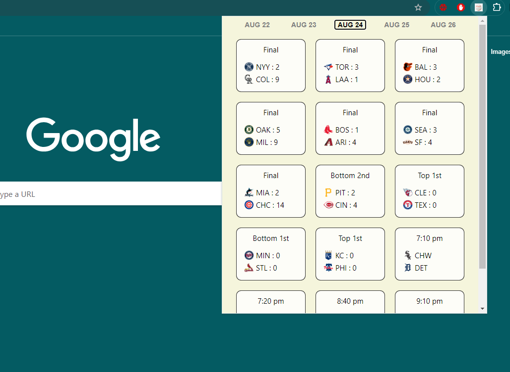

**MLB Score Board Chrome Extension**

[Link to extension](https://chromewebstore.google.com/detail/baseball-scoreboard-mlb-b/kfooeopgnpkdjfacnnofdfmknhandiml)

**Built With**

- Python
- HTML
- CSS
- Javascript
- Express.js
- Node.js

**Features**

- Live MLB game scores with real-time updates
- Box score links for detailed game information
- Date navigation (view scores from past/future days)
- Game status indicators (In Progress, Final, Scheduled)
- Inning-by-inning updates for live games
- Team logos and abbreviations
- **Full MLB Standings** (NEW in v1.0.5)
  - Division standings for all 6 MLB divisions
  - Wild Card race standings and rankings
  - Playoff clinch indicators (x, y, z)
  - Magic numbers for division/playoff clinching (September+)
  - Favorite team highlighting
  - 30-minute data caching for performance
- Team preference selection for notifications

**TODO**

- [x] Add abilty to see previous and future days
- [x] Add full box scores
- [x] Add game inning status
- [x] Add standings
- [ ] Notifications
- [ ] Player statistics in live games
- [ ] Dark mode theme
